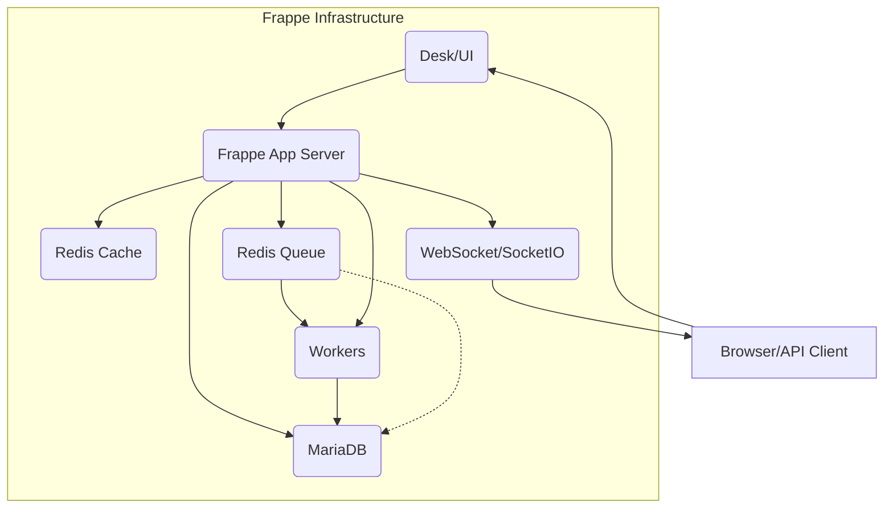
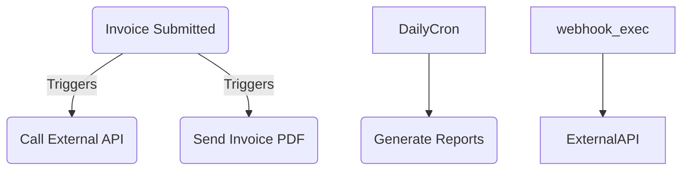

# Frappe & ERPNext Framework – Comprehensive Developer Guide

**Executive Summary:** Frappe is a full-stack, **Python+JS web framework** (with MariaDB) that powers ERPNext, a complete open-source ERP suite【3†L728-L733】【100†L2113-L2117】. This guide synthesizes the official Frappe and ERPNext docs into a single **agent skill** document. It covers core concepts, development workflow, APIs, integrations, customization best practices, security, troubleshooting, and deployment. We include code examples, CLI commands, comparison tables, and **mermaid** diagrams for clarity.

**Scope & Purpose:** This document serves as an IDE agent skill for Frappe/ERPNext, aimed at developers and implementers. It summarizes official documentation on building, customizing, and deploying Frappe apps and ERPNext modules. Each section cites official sources for accuracy. Topics include Frappe core (DocTypes, Desk UI, ORM, hooks, scripts, events, permissions, workflows), ERPNext features, bench workflow, REST/RPC APIs, integrations (webhooks, jobs, scheduler), customization strategies, security models, performance tuning, and practical examples.

## Core Concepts

- **DocTypes:** The central building blocks of Frappe/ERPNext. A DocType defines a *model* (database table schema) and *view* (form/list UI)【27†L752-L760】. Creating a DocType (via UI or code) auto-generates a SQL table (prefixed `tab<Doctype>`) and basic CRUD endpoints. For example, a `Sales Invoice` DocType creates `tabSales Invoice` and provides list and form interfaces【27†L752-L760】【27†L770-L778】. DocTypes support various field types (Data, Link, Table, etc.) and behaviors (autonaming, on-update scripts).  

- **Desk (Web UI):** Frappe’s Desk is the default web interface. It provides the desktop, search, forms and reports without extra setup. Users with roles (System Manager, etc.) can navigate modules, use the AwesomeBar (global search), and customize views. The Desk leverages **Frappe UI** (a Vue-based component library) under the hood【100†L2113-L2117】. As a developer, you can add menus, forms, and custom pages via DocTypes, Web Templates, or the Web View API.

- **ORM & Database API:** Frappe’s Python layer uses a Document-oriented ORM on top of MariaDB. Core APIs include:
  - `frappe.get_doc`, `frappe.new_doc`, `doc.insert()`, `doc.save()`, `doc.submit()`, `doc.cancel()`: create or modify records (doc-level operations)【27†L752-L760】.
  - `frappe.db.sql()`, `frappe.qb` (query builder): execute raw or built queries against MariaDB.
  - Jinja templating API for server-side rendering【58†L744-L752】.
  - DocEvents (see next point) auto-trigger on document operations.
  
- **DocEvent Scripts & Hooks:** Frappe executes well-defined events on DocTypes (e.g. *validate*, *before_save*, *on_submit*, *on_cancel*, *after_delete*). You can hook custom logic via **Server Scripts** or by subclassing controllers in a custom app. For example, a *before_save* hook can enforce business rules before a document is saved. These hooks are declared in an app’s `hooks.py`【34†L728-L736】. Frappe resolves hooks by "last-writer-wins": the last installed app’s hook overrides earlier ones. There are also **install/uninstall hooks** for apps, and asset hooks to include JS/CSS.
  
  - *Client Scripts:* Run in the browser to customize form behavior (field triggers, validation, dynamic UI). These are created via Desk (“Client Script” doctype) and use the `frappe.ui.form.on` API【40†L709-L718】. They can call any JS library since they run on the safe frontend environment, but only apply in the standard form (not via API). Example: validating a Task before submit or auto-fetching a related value【40†L709-L718】.
  
  - *Server Scripts:* Written in Python, they run on the server at DocType events or as custom APIs【43†L727-L736】. Define them via Desk (“Server Script” doctype). For a *DocType Event* script, choose the DocType and trigger (Before Insert, On Update, On Submit, etc.) and write Python. For an *API* script, define a method name and it’s callable via `/api/method/<script_name>`【43†L743-L752】. Server scripts execute in a sandbox (RestrictedPython) for safety【43†L758-L766】. They support rate limiting and can be guest-accessible. From v13+, server scripts can be chained via `frappe.flags.run_script()`【43†L817-L825】.
  
- **Permissions & Roles:** Frappe uses a robust role-based access control. Each user has Roles; Roles grant permissions on DocTypes (Create, Read, Write, Delete, Submit, Cancel, Amend)【30†L772-L781】. Additionally, *Permission Levels* allow grouping fields within a DocType so roles can have different rights on different fieldsets【30†L791-L797】. The **Role Permission Manager** UI lets admins assign or revoke rights per role and DocType. *User Permissions* provide row-level filtering (e.g. limit a Sales Person to see only their own Orders)【30†L800-L809】. Automatic roles exist (All, Guest, Administrator, Desk User, etc.)【30†L823-L832】. From v16+, Frappe supports **Custom Permission Types** for non-CRUD actions (e.g. “approve” an invoice) – created in developer mode and enforced in code via `frappe.has_permission(doc, "approve")`【80†L730-L738】【80†L755-L764】.
  
- **Workflows:** Frappe/ERPNext allow defining multi-stage workflows via the **Workflow** DocType (states, transitions, actions). For example, an Invoice might flow Draft→Submitted→Approved→Paid. Workflows can trigger email alerts or assign tasks. (ERPNext core apps use this for Purchase Orders, Leave Approval, etc.) Although not quoted above, this concept is described in ERPNext docs under *Workflow*.


*Figure: High-level Frappe/ERPNext architecture. Frappe manages web requests, database, Redis (cache/queue/socket), background workers and real-time notifications【24†L728-L731】【55†L775-L783】.*  

## Developer Workflow

- **Bench & CLI:** Frappe provides the *Bench* CLI to manage multi-site setups. Key commands (bench v15+) include:
  - `bench init <bench>`: creates a bench directory (python venv, Redis configs, Procfile, etc.)【24†L749-L757】.
  - `bench new-site <site>`: create a new site (DB, config). 
  - `bench get-app <git-repo>`: download an app (Frappe core or custom).
  - `bench new-app <app>`: scaffold a custom app (with hooks.py, modules).
  - `bench --site <sitename> install-app <app>`: install an app on a site.
  - `bench migrate`: run DB migrations for all apps on all sites.
  - `bench update`: pull latest code, migrate, build assets, restart services.
  - `bench start`: run the development server (logs each process, from Procfile)【67†L730-L739】.
  - `bench serve`: run only webserver (used in VSCode debugging [69]).
  - `bench console`: start a Python REPL with frappe context.
  - `bench execute <method>`: call a whitelisted Python function on the server.
  - `bench run-tests`: run automated tests for apps.
  - **System & config commands:** `bench set-config`, `bench show-config`, `bench enable-scheduler`, `bench bench-version`, etc.
  
  Many of these are summarized in the official cheatsheet【17†L850-L859】【84†L746-L754】. For example, creating a site and installing apps:
  ```bash
  bench new-site site1.local
  bench get-app erpnext
  bench --site site1.local install-app erpnext
  ```
  The **Procfile** (bench/Procfile) defines services (web: gunicorn, socketio, scheduled worker, background workers, Redis)【14†L783-L792】. In production, these are managed by Supervisor.

- **File Structure:** A bench directory contains:
  - `apps/`: Git clones of Frappe and other apps.
  - `sites/`: site-specific folders (site1.local/, with public, private, conf).
  - `config/`: environment configs (Redis, etc).
  - `env/`: the Python virtualenv.
  - `logs/`: log files (e.g. scheduler.log, worker.log).
  - `Procfile`: defines processes (redis_cache, redis_queue, redis_socketio, web, worker, schedule, socketio, watch)【14†L728-L736】【14†L783-L792】.
  
- **App Lifecycle:** Develop apps under `apps/my_app`. Key files:
  - `my_app/hooks.py`: hook definitions (DocType events, scheduler_events, inclusion of JS/CSS, fixtures).
  - `my_app/my_app/doctype/<DocType>`: JSON and Python controller for each DocType.
  - `my_app/www/` or `my_app/templates/pages`: web pages.
  - `my_app/public/` and `my_app/public/js/css`: public assets.
  - After code changes, run `bench migrate` (database) and `bench build` (assets) or `bench update`.
  - For schema changes, use `_execute/` versioned migration scripts (see **Migrations** docs【18†】).
  
- **Testing & CI:** Frappe has a built-in test framework using Python’s unittest (tests in apps under `tests/`). Run via `bench run-tests`. For CI, tests can be executed headlessly. Also, Frappe supports UI tests with Selenium (via `bench ui-test` or Apps like ERPNext have feature tests). Continual integration pipelines typically pull code, `bench migrate`, and run unit tests. The **Migrations** page【18†】 and **Zero-downtime migrations**【230†】 cover strategies for altering tables without lockouts.

## APIs (REST & RPC)

Frappe auto-exposes all DocTypes via a RESTful HTTP API【48†L728-L736】【50†L1002-L1011】. Key points:

- **Authentication:**  
  - Session cookie: POST `/api/method/login` with username/password returns a session cookie for subsequent calls.
  - Token-based: Generate API Key and Secret under a User document (User > Settings > API Access【48†L728-L736】). Then include header `Authorization: token <api_key>:<api_secret>`【48†L741-L750】.
  - OAuth2/Bearer tokens are also supported (via token endpoints).
  
- **List / Query Endpoint:**  
  `GET /api/resource/<DocType>` returns a list of documents (names)【48†L818-L827】. Supports query parameters:
  - `fields=["field1","field2"]` to include specific fields【48†L818-L827】.
  - `filters=[["DocType","field","=",value], …]` for server-side filtering.
  - `limit_page_length` (page size), `limit_start` (offset), `order_by`.
  - `order_by="modified desc"`, `limit_page_length=20`, etc.
  - `order_by` sorting, `filters` for conditions (example: `?filters=[["Sales Invoice","status","=","Paid"]]`).
  
- **Get Document:**  
  `GET /api/resource/<DocType>/<Name>` returns all fields of that document in JSON【49†L1041-L1049】. The `expand=1` flag will fetch linked records’ data inline【48†L876-L885】.

- **Create / Update / Delete:**  
  - **Create:** `POST /api/resource/<DocType>` with JSON payload `{ "field1": value1, ... }`【49†L1002-L1011】. Returns the new document.
  - **Update:** `PUT /api/resource/<DocType>/<Name>` with JSON of fields to update (commits changes)【50†L1092-L1101】.
  - **Delete:** `DELETE /api/resource/<DocType>/<Name>` deletes the doc (subject to permission rules)【50†L1121-L1128】.
  - All mutations require the user to have write permission on that DocType instance.

- **Whitelisted Methods (RPC):**  
  You can call any *whitelisted* Python method via `POST /api/method/<module>.function`【50†L1132-L1140】. Use `@frappe.whitelist()` in your Python code. Sends/receives JSON. For write operations, use `POST`; for read, you can use `GET`.
  Example:
  ```bash
  curl -X POST https://site/api/method/myapp.utils.custom_method \
       -H "Authorization: token ABC:XYZ" \
       -H "Content-Type: application/json" \
       -d '{"arg": "value"}'
  ```
  Error responses include an `"exc_type"` and stack trace message; handle these gracefully on the client.

- **File Upload:**  
  Upload via the `upload_file` API: `POST /api/method/upload_file` with form-data (file, filename, folder, doctype, docname)【50†L1161-L1169】. Returns file record details.

- **Error Handling:**  
  Frappe returns HTTP status codes and JSON: e.g. 403 for permission errors, 404 if DocType not found, 200 with `{ "message": ... }` on success, 500+ with `"exc_type"` on internal errors【50†L1132-L1140】【73†L777-L785】.

## Integration Patterns

- **Webhooks:** Frappe can send HTTP callbacks on DocType events【52†L728-L734】. Configure a webhook (DocType = “Webhook”) with: event (e.g. “On Update” of Sales Invoice), conditions (filter by doc values), target URL, HTTP method, headers, and payload (either form-encoded fields or JSON via Jinja templates). When the event fires, Frappe posts the data. A secret key (HMAC-SHA256) can be included for security【52†L767-L775】. Webhooks are useful to notify external systems of changes (e.g. push new Order to another service).

- **Background Jobs (Asynchronous Tasks):**  
  Frappe uses **RQ (Redis Queue)** for async tasks【55†L732-L740】. Use `frappe.enqueue(method, **args)` in Python to run `method` asynchronously (e.g. `frappe.enqueue('myapp.utils.task', arg1=val)`【55†L732-L740】). For Doc-specific tasks, use `frappe.enqueue_doc('DocType', name, 'method_name', queue='default')` to call a controller method after commit【55†L761-L769】. There are three default queues: *short*, *default*, and *long* (with timeouts 300s, 300s, 1500s)【55†L775-L783】. You can define custom queues in `sites/common_site_config.json`. Workers (spawned via `bench worker`) listen on queues【55†L799-L807】. Example:  
  ```python
  # Run a long task in background
  frappe.enqueue('myapp.tasks.process_data', data=dataset, queue='long')
  ```
  Supervisors start multiple workers (short/default/long) for concurrency. 

- **Scheduler/Periodic Tasks:**  
  Define `scheduler_events` in hooks.py or via the "Scheduler Event" doctype【55†L838-L846】. You can schedule functions hourly, daily, monthly or cron-like. For example:
  ```python
  # in hooks.py
  scheduler_events = {
      "daily": ["myapp.utils.daily_task"],
      "cron": {
          "0 0 * * *": ["myapp.utils.midnight_task"]
      }
  }
  ```
  These run in the background (via `scheduler.py` worker). After changing scheduled jobs, run `bench migrate` to update cron【55†L857-L860】.

- **Redis and Workers:**  
  Frappe uses Redis in three roles: `redis_cache` for caching, `redis_queue` for background jobs, and `redis_socketio` for realtime push (Pub/Sub for chat/notifications)【14†L772-L779】. In production, each is managed by supervisord as separate processes. Workers (gunicorn) poll `redis_queue` for tasks to execute【55†L775-L783】. Real-time features (chat, notifications) publish via `redis_socketio`.


*Figure: Integration flows — e.g. on a document event, trigger webhooks or background tasks. Scheduled jobs run periodically via the Frappe scheduler.*  

## Customization Strategies

- **Built-in vs Custom App:** For changing behavior, prefer **custom apps** over hacking core. Use the **Customize Form** UI for quick tweaks (add custom fields, property setters, change field labels)【58†L744-L752】. However, Customize Form modifications are **site-specific**; they live in metadata (Property Setter and Custom Field records). To make these repeatable, use the *Export Customizations* feature【64†L698-L707】: it exports site custom fields and property setters into your custom app (`your_app/your_module/custom/<Doctype>.json`) so they are version-controlled and re-deployable【58†L744-L752】【64†L698-L707】. 

- **Custom Fields & Property Setters:** For minor tweaks (e.g. change default, hide a field), use the Desk (Customize Form). For reusability, register them in your app via the export. A *Property Setter* overrides a DocType property (like making a default filter). These allow **site-by-site** override without editing the core DocType. 

- **Overriding Logic:** Use **Hooks.py** to override server logic. For example, the `override_whitelisted_methods` hook can replace core functions. For UI alterations, use Client Scripts or include custom JS files (`hooks.py`: `app_include_js`). **Server Scripts** (Desk) let administrators add Python code without redeploying.

- **ERPNext-specific Customization:** ERPNext apps consist of many standard DocTypes (Sales Invoice, Purchase Receipt, etc.). Custom fields or behaviors specific to a company should be in a **Custom App** (ERPNext or others) to avoid upgrade conflicts. Domain settings (e.g. enabling Manufacturing or HR modules) are done via ERPNext configuration, not by code.
  
- **Permission Management:** Use Role Permission Manager to assign DocType permissions. For custom actions, consider **Custom Permission Types** (v16+)【80†L730-L738】. Grant them via the same UI. For row-level security, set up **User Permissions** to filter link fields.

- **Best Practices:** Never edit core files. Instead, use hooks, custom scripts, and app overrides. Use version control for custom apps. Maintain separate configs (via `sites/{site}/site_config.json`) for environment differences (e.g. SMTP, Redis password). Document assumptions: e.g. ERPNext expects certain roles (Administrator, System Manager) exist by default. 

**Config vs Code:**  
| Use Case                       | Configure (UI/Settings)            | Custom App / Code          |
| ------------------------------ | ---------------------------------- | -------------------------- |
| Changing field label / default | Customize Form / Property Setter【58†L744-L752】    | (Not needed in code)      |
| Adding custom fields           | Customize Form (then export)【58†L744-L752】       |                        |
| New page or endpoint           | Doctype/Web Form/UI and Scripts    | Web Template / Flask route |
| Business logic on save         | Server Script (Doc Event)【43†L727-L736】         | Doctype event override in app |
| Scheduled/cron job             | Hooks.py `scheduler_events` or UI【55†L838-L846】  | App scheduler function    |
| Webhook to external system     | Webhooks doctype【52†L728-L734】        | Or `frappe.enqueue` call an API |
| Security roles/perm setup      | Role Permission Manager (Desk)【30†L772-L781】    | -                        |

## Troubleshooting & Debugging

- **Logs:** Bench start shows logs in console (see [67]). Each service logs to files in `bench/logs` and `sites/{site}/logs`【73†L752-L761】. Important files: `frappe.log` (error snapshots for 500 errors)【73†L777-L785】, `scheduler.log`, `worker.log`. In the UI, check *Error Log* and *Activity Log* (Desk logs)【73†L728-L734】. Enable more logging by setting `enable_frappe_logger: true` in `site_config.json`.

- **Print & Debugger:** In Python, `print()` appears in the `web` or `worker` logs (depending on request vs background job)【67†L805-L812】. In JS, use `debugger;` statements with browser DevTools open【69†L843-L852】. The global `frappe` object can be used in browser console for quick queries【69†L857-L865】.

- **Common Issues:** 
  - *Scheduler/Worker stuck:* Run `bench doctor` to view scheduler status, worker count, and pending tasks【96†L732-L740】. Use `bench show-pending-jobs` to list queued tasks【96†L744-L753】, or `bench purge-jobs` to clear.
  - *Database deadlocks / slow queries:* Check MariaDB logs, enable slow query log. Use the **Database Optimization** guide to tune innodb_buffer_pool_size (e.g. 70% of RAM) and ensure SSD disks【94†L7-L15】【94†L31-L38】.
  - *Permissions errors:* Verify role permissions in Role Permission Manager. Clear cache (`bench clear-cache`) after permission changes.

- **VSCode Debugging:** The docs provide steps for debugging with VS Code by customizing the Procfile and `launch.json`【69†L868-L877】. This allows stepping through Python code. (In short: run `bench serve` via VSCode debug instead of `bench start`).
  
- **Bench Diagnoses:** Use `bench version` to check Frappe/ERPNext versions. `bench show-config` reveals site config values. `bench migrate --refresh` can rebuild translations and patches if things break.

## Security & Permissions Model

- **Authentication:** Frappe uses hashed passwords (PBKDF2-SHA256)【76†L756-L760】. Sessions use secure cookies (`Secure` flag on HTTPS)【76†L798-L806】. TLS is recommended to encrypt traffic【76†L745-L754】. Password rules (strength) can be configured in System Settings, and 2FA can be enabled for added security.

- **Permissions:** We covered role/DocType permissions above【30†L772-L781】【80†L730-L738】. Important points:
  - **Field-level:** You can restrict view/edit of certain fields (via *Permission Level* or field property “permlevel”).
  - **Row-level:** User Permissions restrict individual records (e.g. restrict Bank entries to a branch).
  - **Automatic Roles:** “Guest” has no permissions by default; “All” means everyone including Guest; “Administrator” bypasses restrictions【30†L823-L832】.
  - **Auditing:** Frappe tracks document creation/modification/user in every record. Audit Trail (Desk > General > Audit Trail) shows who changed what【56†】.
  - **Cross-Site Security:** Frappe domains serve only their content; you cannot isolate apps by path (cookie path is `/`)【76†L791-L799】.
  
- **Server-Side Protections:** All client calls (RPC) must go through whitelisted methods or REST routes. The **RestrictedPython** sandbox in Server Scripts prevents dangerous operations【43†L758-L766】. Cross-Site Request Forgery (CSRF) protection is built in for web forms.

- **ERPNext Considerations:** ERPNext respects Frappe’s security model. Modules may have additional checks (e.g. one cannot cancel a submitted Purchase Invoice without Cancel permission). ERPNext’s **Permission Error** pages in docs help debug access issues.

## Performance Tuning & Deployment Architecture

- **Production Stack:** A typical production stack: Nginx (reverse proxy / static files), Supervisor-managed services (Gunicorn for web, Redis, workers). The official **Easy Install** script sets this up on Debian/Ubuntu/CentOS (with `--production` flag)【84†L732-L740】. For example, after setup, `supervisorctl status` should list multiple Frappe processes (redis_cache, redis_queue, frappe-web, workers, etc.)【84†L758-L767】. Ensure Nginx (or Apache) is configured as HTTPS endpoint (Let's Encrypt / cert manager recommended).

- **Scaling:** 
  - **Vertical scaling:** Start with at least 2 vCPU. Database CPU should not be at 100% under normal load【94†L7-L15】. Add CPU/RAM as needed. ERP/CRM usage typically requires ample RAM for InnoDB buffer pool: set `innodb_buffer_pool_size` to ~70-80% of available memory【94†L31-L38】.
  - **Disk:** Use SSD or high-IOPS disks. Allocate ~3x current data size to allow growth【94†L19-L27】.
  - **Multiple Workers:** For high load, run multiple worker instances per queue. Redis namespaces can allow multiple benches to share a Redis instance【84†L808-L818】.
  - **Web concurrency:** Gunicorn (bench serve) runs with multiple workers (2 × CPU cores by default). Behind Nginx, static assets (JS/CSS/images) are served directly.

- **Caching:** Frappe uses Redis for caching ORM queries and sessions (redis_cache) and for website caching (if enabled via RedisCacheManager). In `common_site_config.json`, you can configure caching (see *Caching* guide). Use CDN or browser cache headers for static assets.

- **Backups:** Use `bench backup` to dump DB and files【86†L732-L740】. Example:
  ```bash
  bench --site site1.local backup --with-files --compress
  ```
  By default, backups go to `sites/site1.local/private/backups`. Schedule these via cron for daily/weekly backups. You can backup only certain doctypes (`--only`) or exclude logs (`--exclude`)【86†L761-L770】【86†L773-L782】. Restoring is via `bench restore`.

- **High Availability:** For very large deployments, consider read replicas (Frappe supports MariaDB replicas via `read_sql` in hooks) and load-balancing web/proxy layers. For zero-downtime, use “Bench migrate-csv-to-po” for translations and read the **Zero-downtime migrations** guide【230†】.

- **Monitoring:** Use `bench doctor` (see above) to check background jobs. For system metrics, monitor Redis, MySQL performance, queue length. Frappe’s **Logging** page suggests enabling detailed site logs for errors【73†L752-L761】. Use external APM or logging (ELK, Prometheus) as needed.

## REST/RPC API Examples

- **Authentication (Session):**
  ```bash
  curl -X POST https://example.com/api/method/login \
       -H "Content-Type: application/json" \
       -d '{"usr":"user@example.com", "pwd":"mypassword"}'
  ```
  The response sets a `sid` cookie. Use that cookie in subsequent API calls.

- **Authentication (Token):**  
  1. In Desk, open a User, generate API Key/Secret.  
  2. Use header: `Authorization: token API_KEY:API_SECRET`.  
  e.g., `-H "Authorization: token aBc123:SeCrEt"`.

- **List Documents:**  
  ```bash
  curl https://example.com/api/resource/Customer \
       -H "Authorization: token aBc:SeCrEt"
  ```  
  Returns: `{"data":[{"name":"CUST-0001"},...]}`. To fetch fields:
  ```bash
  curl "https://.../api/resource/Customer?fields=[\"name\",\"customer_name\"]" \
       -H "Authorization: token aBc:SeCrEt"
  ```

- **Create Document:**  
  ```bash
  curl -X POST https://example.com/api/resource/ToDo \
       -H "Authorization: token aBc:SeCrEt" \
       -H "Content-Type: application/json" \
       -d '{"description":"Call Alice","status":"Open"}'
  ```
  Response: `{"data":{"name":"TODO-0001","description":"Call Alice","status":"Open",...}}`.

- **Update Document:**  
  ```bash
  curl -X PUT https://example.com/api/resource/ToDo/TODO-0001 \
       -H "Authorization: token aBc:SeCrEt" \
       -H "Content-Type: application/json" \
       -d '{"status":"Closed"}'
  ```

- **Delete Document:**  
  ```bash
  curl -X DELETE https://example.com/api/resource/ToDo/TODO-0001 \
       -H "Authorization: token aBc:SeCrEt"
  ```

- **Call Custom Method:** Suppose in `myapp/api.py` you have:
  ```python
  @frappe.whitelist()
  def add(a, b): 
      return {"sum": int(a) + int(b)}
  ```
  Then:  
  ```bash
  curl -X POST https://example.com/api/method/myapp.api.add \
       -H "Authorization: token aBc:SeCrEt" \
       -H "Content-Type: application/json" \
       -d '{"a":2,"b":3}'
  ```  
  Response: `{"message":{"sum":5}}`.  

See the **REST API guide** for full details (authentication flows, error formats)【48†L728-L736】【50†L1132-L1140】.

## Integration Use-Cases

- **Webhooks:** E.g. to notify another system of a new Sales Invoice:
  1. In Desk, create **Webhook**: DocType = “Sales Invoice”, Trigger = “On Update”, Conditions = `status == "Paid"`, URL = `https://hooks.example.com/invoices`, Payload as JSON with invoice fields.  
  2. When a Sales Invoice is saved with “Paid”, Frappe POSTs the data to the URL【52†L728-L734】.

- **Scheduled Reports:** Write a scheduler event to email reports. In `hooks.py`:
  ```python
  scheduler_events = {"daily": ["myapp.reports.send_daily_summary"]}
  ```
  And in `myapp/reports.py`:
  ```python
  @frappe.whitelist() 
  def send_daily_summary():
      # gather data, send email
  ```
  
- **Background Task Example:**  
  ```python
  def submit_expensive_job(doc, method):
      # Enqueue heavy task after invoice is submitted
      frappe.enqueue('myapp.tasks.generate_invoice_pdf', invoice=doc.name, queue='long')

  # Hook this in hooks.py or controller: on_submit of Sales Invoice
  ```
  
- **CLI Commands Summary:** For quick reference:
  ```bash
  # Initialize bench and create site
  bench init frappe-bench --frappe-branch version-15
  cd frappe-bench
  bench new-site site1.local
  # Develop and test
  bench start
  bench console
  bench execute myapp.utils.method
  bench new-app my_app
  bench --site site1.local install-app my_app
  # Manage apps/sites
  bench list-apps
  bench migrate
  bench update
  bench backup --with-files
  bench restore [file]
  bench doctor  # diagnose jobs
  ```

## Examples & Snippets

- **Python DocEvent:** (inside an app’s `doctype/customer/customer.py`)
  ```python
  def before_submit(self):
      if self.credit_limit and self.net_total > self.credit_limit:
          frappe.throw("Over credit limit!")
  ```
  
- **Client Script (JS):** 
  ```javascript
  // Client Script for Task doctype: Validate status change
  frappe.ui.form.on('Task', {
      before_save(frm) {
          if(frm.doc.status==='Completed' && !frm.doc.time_logs) {
              frappe.msgprint("Add time logs first");
              frappe.validated = false;
          }
      }
  });
  ```
- **mermaid Workflow Example:**  
  ```mermaid
  flowchart LR
    Draft -->|Submit| Pending
    Pending -->|Approve| Approved
    Pending -->|Reject| Rejected
    Rejected --> Draft
    Approved --> Completed
  ```
  *Figure: Example document approval workflow (conceptual).*

- **Mermaid Architecture:**  

  ```mermaid
  flowchart LR
    subgraph Clients
      C1[Web Browser] -->|HTTP/WS| Nginx
      C2[Mobile App / Scripts] -- API --> Nginx
    end
    subgraph Server
      Nginx -->|Proxy| Frappeserver
      Frappeserver["Frappe (Gunicorn)"] --> MariaDB[(MariaDB/MySQL)]
      Frappeserver --> RedisCache[(Redis Cache)]
      Frappeserver --> RedisQueue[(Redis Queue)]
      Frappeserver --> NodeSocketIO[(SocketIO)]
      NodeSocketIO --> C1
    end
    subgraph Workers
      U1[Short Worker] --> RedisQueue
      U2[Default Worker] --> RedisQueue
      U3[Long Worker] --> RedisQueue
    end
    RedisQueue -->|Tasks| U1 & U2 & U3
  ```

## Summary of Frappe vs ERPNext

- **Frappe Framework:** Provides the underlying tools – DocTypes, REST API, scripting, hooks, tasks, UI components【3†L728-L733】【24†L728-L731】. It is **app-agnostic** (batteries-included web framework). Use Frappe to build any web app or to extend ERPNext.
- **ERPNext Application:** Built on Frappe; includes dozens of pre-made DocTypes (Accounts, HR, CRM, Manufacturing, Website, etc.) with business logic. ERPNext’s modules leverage Frappe core (e.g. an “Invoice” DocType with domain-specific behavior). For ERP customizations, either use ERPNext’s built-in features (domains, data imports) or develop custom apps that depend on ERPNext.
- **Choosing Approach:** If your change is simple and specific to one site, using **Customize Form** and server scripts may suffice. If it’s a reusable feature or needs code-level logic, create a **Custom App**. Configuration (via System Settings, Domains, Chart of Accounts) should be used whenever possible over code hacks.

## Citations

- Frappe Intro & Features【3†L728-L733】【24†L728-L731】  
- ERPNext Intro & Key Features【9†L2058-L2062】【100†L2113-L2117】  
- Directory Structure & Procfile【14†L728-L736】【14†L783-L792】  
- Bench Commands (new-app, new-site, etc.)【17†L850-L859】【84†L746-L754】  
- Understanding DocTypes【27†L752-L760】【27†L770-L778】  
- Users & Permissions【30†L772-L781】【80†L730-L738】  
- Hooks & Custom Scripts【34†L728-L736】【43†L727-L736】  
- Client & Server Scripts【40†L709-L718】【43†L727-L736】  
- REST API (endpoints, auth)【48†L728-L736】【50†L1002-L1011】  
- Webhooks【52†L728-L734】【52†L767-L775】  
- Background Jobs & Scheduler【55†L732-L740】【55†L775-L783】  
- Customization & Customize Form【58†L744-L752】【64†L698-L707】  
- Debugging & Logging【67†L805-L812】【73†L752-L761】  
- Production Setup & Updates【84†L732-L740】【84†L758-L767】  
- Bench Diagnosing Scheduler【96†L732-L740】【96†L744-L753】  
- Permission Types (v16+)【80†L730-L738】【80†L755-L764】  

This concludes the **agent_skill_frappe_erpnext.md** reference guide for Frappe Framework and ERPNext. 

