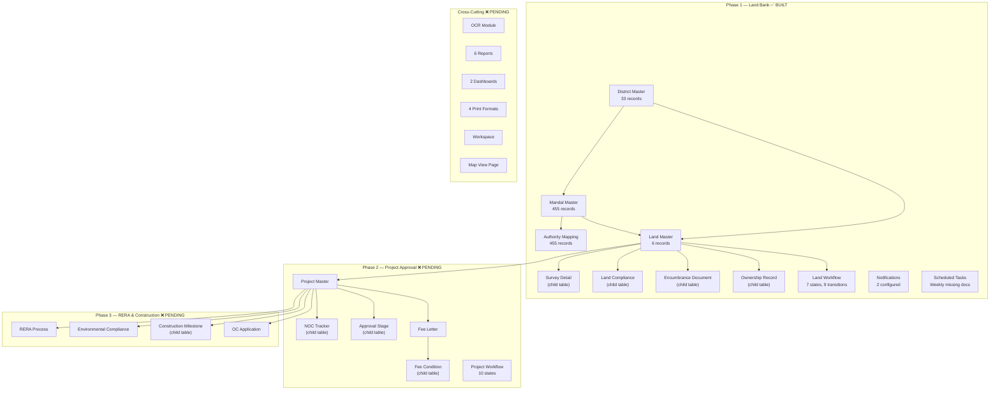

# LB-PAMS — Complete Application Walkthrough

> **Land Bank & Project Approval Management System**
> Custom Frappe app layered on ERPNext | Site: `selfcare.tridasa.in`

---

## 1. Architecture Overview



---

## 2. What Has Been Built ✅

### 2.1 Application Scaffold

| Item | Details |
|------|---------|
| **App name** | `lbpams` |
| **Module** | `LBPAMS` |
| **Required apps** | `erpnext` |
| **Source files** | 35 files (13 .py, 1 .js, 10 .json, 11 support files) |
| **Custom roles** | 6 — Land Manager, Legal Team, Survey Team, Project Manager, Approval Liaison Officer, Management |
| **Site** | `selfcare.tridasa.in` (http://192.168.252.6:8002) |

**Key files:**

| File | Purpose |
|------|---------|
| [hooks.py](file:///home/demo/frappe-bench2/apps/lbpams/lbpams/hooks.py) | Fixtures (roles, workflow, notifications), scheduler, after_install |
| [setup.py](file:///home/demo/frappe-bench2/apps/lbpams/lbpams/setup.py) | Master data population (33 districts, 455+ mandals, authority mappings) |
| [setup_workflow.py](file:///home/demo/frappe-bench2/apps/lbpams/lbpams/setup_workflow.py) | Workflow + notification creation script |
| [tasks.py](file:///home/demo/frappe-bench2/apps/lbpams/lbpams/tasks.py) | Weekly missing documents scheduled job |
| [install.py](file:///home/demo/frappe-bench2/apps/lbpams/lbpams/install.py) | Post-install hook (runs setup + workflow on app install) |

---

### 2.2 DocTypes — Complete Inventory (8 DocTypes)

#### Stage 1 — Foundation Masters (3 DocTypes)

##### District Master
- **Type:** Regular | **Naming:** By district_name
- **Fields:** district_name, state, is_active
- **Records:** 33 (all Telangana districts)
- **File:** [district_master.json](file:///home/demo/frappe-bench2/apps/lbpams/lbpams/lbpams/doctype/district_master/district_master.json)

##### Mandal Master
- **Type:** Regular | **Naming:** By mandal_name
- **Fields:** mandal_name, district (Link→District Master), is_active
- **Records:** 455 (all Telangana mandals)
- **Cascading:** District→Mandal parent-child filter configured
- **File:** [mandal_master.json](file:///home/demo/frappe-bench2/apps/lbpams/lbpams/lbpams/doctype/mandal_master/mandal_master.json)

##### Authority Mapping
- **Type:** Regular | **Naming:** By mandal
- **Fields:** mandal (Link→Mandal Master), authority (Select: GHMC/HMDA/DTCP)
- **Records:** 455 (one per mandal)
- **Purpose:** Determines which approval authority governs each mandal
- **File:** [authority_mapping.json](file:///home/demo/frappe-bench2/apps/lbpams/lbpams/lbpams/doctype/authority_mapping/authority_mapping.json)

---

#### Stage 2 — Land Master Core (1 Parent DocType)

##### Land Master
- **Type:** Submittable | **Naming:** `LAND-.YYYY.-.####`
- **Records:** 6 test records
- **Tabs:** Details | Survey Details | Compliance | Ownership Chain | Land Documents | Notes
- **File:** [land_master.json](file:///home/demo/frappe-bench2/apps/lbpams/lbpams/lbpams/doctype/land_master/land_master.json)

**Fields (35 total):**

| Section | Fields |
|---------|--------|
| **Basic Identity** | naming_series, land_name, total_extent_acres, total_extent_guntas, total_extent_display, facing, land_nature, current_status, risk_flag, **title_status** |
| **Location** | state (default: Telangana), district (Link), mandal (Link), village, pin_code, latitude, longitude, google_map_link, location (Geolocation) |
| **Child Tables** | survey_details → Survey Detail, land_compliance → Land Compliance, **ownership_records → Ownership Record**, encumbrance_documents → Encumbrance Document |
| **Notes** | internal_notes (Text Editor), amended_from |

**Permissions:**
- System Manager: Full access
- Land Manager: Read, Write, Create
- Legal Team: Read, Write, Submit
- Survey Team: Read, Write
- Project Manager: Read only
- Approval Liaison Officer: Read only
- Management: Full CRUD + Submit/Cancel/Amend

**Controller — 11 validation methods:**

| Method | What It Does |
|--------|-------------|
| `auto_fetch_location_hierarchy()` | Ensures State→District→Mandal consistency |
| `validate_extent()` | Blocks save if acres ≤ 0 |
| `validate_survey_extents()` | Warns if survey total > declared total |
| `compute_total_extent_display()` | Auto-formats "X Acres Y Guntas" |
| `compute_development_eligibility()` | GO 111, defense, airport, buffer zone checks → Yes/No/Conditional |
| `check_document_completeness()` | Sets risk_flag if EC, Sale Deed, Pahani, or FMB missing |
| `validate_ownership_chain()` | Detects gaps (>6 months) and overlaps, sets title_status |
| `update_verification_dates()` | Auto-sets date when verified_by is assigned |
| `validate_document_validity()` | Warns if EC/Pahani has expired |
| `update_google_map_link()` | Generates Maps URL from lat/lng |
| `update_geolocation()` | Populates Frappe Geolocation field from coordinates |

**Client Script — Key features:**
- Cascading location filters (State → District → Mandal)
- Google Maps link generation + Geolocation field update
- Risk flag dashboard headline
- **Title status color indicator** (green/orange/red/blue pill)
- **Ownership chain row color-coding** (green=clear, amber=gap, red=overlap)
- **Date overlap detection** with inline warnings
- **Document category filtering** for Land Documents
- Auto-set verification date on verifier assignment
- "View on Map" custom button

**File:** [land_master.py](file:///home/demo/frappe-bench2/apps/lbpams/lbpams/lbpams/doctype/land_master/land_master.py) | [land_master.js](file:///home/demo/frappe-bench2/apps/lbpams/lbpams/lbpams/doctype/land_master/land_master.js)

---

#### Stage 3 — Child Tables for Land Master (4 Child DocTypes)

##### Survey Detail
- **Type:** Child Table | **Parent:** Land Master
- **Fields (8):** survey_number, subdivision_number, extent_acres, extent_guntas, classification, patta_number, revenue_sketch_available
- **File:** [survey_detail.json](file:///home/demo/frappe-bench2/apps/lbpams/lbpams/lbpams/doctype/survey_detail/survey_detail.json)

##### Land Compliance
- **Type:** Child Table | **Parent:** Land Master
- **Fields (24):** zoning_type, master_plan_road_affected, road_width_metres, permissible_far, permissible_ground_coverage, water_body_nearby, water_body_distance_metres, lake_buffer_zone_ftl, fsl_level, nala_nearby, nala_width_classification, railway_buffer, railway_distance_metres, ht_line_buffer, ht_line_distance_metres, gas_pipeline_buffer, defense_zone, airport_funnel_zone, airport_distance_km, go_111_area, hmda_green_zone, ghmc_limits, hmda_jurisdiction, development_eligible, eligibility_remarks
- **Auto-computed:** development_eligible (Yes/No/Conditional) + eligibility_remarks
- **File:** [land_compliance.json](file:///home/demo/frappe-bench2/apps/lbpams/lbpams/lbpams/doctype/land_compliance/land_compliance.json)

##### Encumbrance Document (Land Documents)
- **Type:** Child Table | **Parent:** Land Master
- **Fields (21):** document_category, document_type (25 options), document_number, document_date, period_from, period_to, validity_date, issued_by, issuing_office, file_attachment, remarks, verification_status, verified_by, verification_date, verification_remarks, ocr_status, ocr_extracted_data
- **Categories:** Title Document, Revenue Record, Encumbrance Record, Compliance Document, Legal Opinion, Other
- **File:** [encumbrance_document.json](file:///home/demo/frappe-bench2/apps/lbpams/lbpams/lbpams/doctype/encumbrance_document/encumbrance_document.json)

##### Ownership Record
- **Type:** Child Table | **Parent:** Land Master
- **Fields (17):** owner_name, owner_type (7 options), co_owner_names, acquisition_mode (10 options), from_date, to_date, chain_status (auto-computed), registration_number, registration_date, registration_office, consideration_amount, stamp_duty_paid, source_document_idx, remarks
- **Auto-computed:** chain_status → Clear / Gap Before / Overlap / Disputed
- **File:** [ownership_record.json](file:///home/demo/frappe-bench2/apps/lbpams/lbpams/lbpams/doctype/ownership_record/ownership_record.json)

---

### 2.3 Land Master Approval Workflow

**Name:** `Land Master Approval` | **Active:** ✅ Yes

```mermaid
stateDiagram-v2
    [*] --> Draft
    Draft --> UnderVerification : Submit for Verification<br/>[Land Manager]
    UnderVerification --> LegallyVerified : Mark as Legally Verified<br/>[Legal Team]
    UnderVerification --> UnderLitigation : Flag as Under Litigation<br/>[Legal Team]
    UnderVerification --> Draft : Return to Draft<br/>[Legal Team]
    LegallyVerified --> ApprovedForDev : Approve for Development<br/>[Management]
    LegallyVerified --> OnHold : Put On Hold<br/>[Management]
    LegallyVerified --> Rejected : Reject<br/>[Management]
    UnderLitigation --> UnderVerification : Litigation Resolved<br/>[Legal Team]
    OnHold --> LegallyVerified : Resume<br/>[Management]

    state Draft {
        note : Editable by Land Manager
    }
    state UnderVerification {
        note : Editable by Legal Team
    }
    state LegallyVerified {
        note : Editable by Legal Team
    }
    state ApprovedForDev {
        note : Submitted (docstatus=1)
    }
```

**Conditional Gates:**
- **Draft → Under Verification:** Requires `survey_details` to exist (truthy check)
- **Legally Verified → Approved for Development:** Requires `development_eligible != "No"` on first compliance row

---

### 2.4 Notifications (2 Active)

| Name | Event | Condition | Recipients |
|------|-------|-----------|------------|
| **Land Litigation Flag Alert** | Value Change (workflow_state) | `== "Under Litigation"` | Legal Team, Management |
| **Land Workflow State Change** | Value Change (workflow_state) | `!= "Under Litigation"` | Document owner |

---

### 2.5 Scheduled Tasks (1 Active)

| Task | Schedule | What It Does |
|------|----------|-------------|
| **Weekly Missing Documents Report** | Every Monday | Queries risk-flagged Land Masters, builds HTML table of missing docs + title chain issues, emails Land Manager role |

---

### 2.6 Master Data Summary

| DocType | Record Count | Source |
|---------|-------------|--------|
| District Master | 33 | `setup.py` — all Telangana districts |
| Mandal Master | 455 | `setup.py` — all Telangana mandals with district links |
| Authority Mapping | 455 | `setup.py` — GHMC (Hyderabad, Medchal, Rangareddy, Sangareddy, Yadadri), HMDA, DTCP (rest) |
| Land Master | 6 | Test records (Shamshabad, Golconda, Gandipet, Kompally, Patancheru, test) |
| Workflow | 1 | Land Master Approval (7 states, 9 transitions) |
| Notification | 2 | Litigation alert + state change |

---

## 3. What Is Still Pending ❌

### Phase 2 — Project Approval & Execution (Stages 6-9)

> [!IMPORTANT]
> Phase 2 can only begin after Phase 1 workflows are tested end-to-end and at least one Land Master reaches "Approved for Development" state.

#### Stage 6 — Project Master Core (est. 2-3 days)

##### NEW: Project Master DocType
- **Type:** Submittable | **Naming:** `PROJ-.YYYY.-.####`
- **Purpose:** Represents a real estate project on approved land
- **Key fields:**
  - project_name, linked_land (Link→Land Master, filtered: workflow_state = "Approved for Development")
  - approval_authority (auto-detected from land location via Authority Mapping)
  - project_type (Villas / Apartments / Plotted Layout / Commercial / Mixed Use)
  - total_extent_used, built_up_area, number_of_units, mortgage_units (auto = ceil(units×10%))
  - permissible_far, permissible_ground_coverage (fetched from Land Compliance)
  - Pre-approval checklist: approach_road, road_width_adequate, land_conversion_required/status, revenue_sketch_available, title_clear, no_encumbrance_pending
- **Server hooks:** Authority auto-detection, extent validation (cannot exceed land total), mortgage unit auto-calc
- **Child tables:** NOC Tracker, Approval Stage, Construction Milestone

##### NEW: NOC Tracker (Child Table)
- **Parent:** Project Master
- **Fields:** noc_type (10 authority options), applied_date, expected_date, received_date, noc_number, valid_upto, document (Attach), status (Not Applied→Received/Expired), follow_up_remarks
- **Workflow gate:** All NOCs must be "Received" before file submission

##### NEW: Approval Stage (Child Table)
- **Parent:** Project Master
- **Fields:** stage_name (8 stages), assigned_to (User), submitted_date, due_date, completed_date, days_taken (auto), status, document_attached, remarks
- **ToDo integration:** Creates Frappe Assignment when assigned
- **Color indicators:** Green (<30 days), Amber (30-60), Red (>60 days overdue)

---

#### Stage 7 — Fee Letter & Conditions (est. 1-2 days)

##### NEW: Fee Letter DocType
- **Type:** Submittable | **Naming:** `FL-.YYYY.-.####`
- **Fields:** project_master (Link), issued_date, due_date (auto = +30 days), issued_by_authority, letter_reference, scanned_letter, total_amount (auto-sum), payment_status (auto-computed), building_permit_issued, building_permit_order, approved_plan_set
- **Server hooks:** Due date auto-set, payment status auto-computation

##### NEW: Fee Condition (Child Table)
- **Parent:** Fee Letter
- **Fields:** condition_type (9 types), description, amount, units, status (Pending/Paid/Transferred/Waived), payment_date, receipt_number, receipt_attachment, remarks

---

#### Stage 9 — Project Workflow (est. 1-2 days)

##### NEW: Project Master Approval Workflow
- **10 States:** Draft → Pre-Approval Check → NOC Collection → File Submitted → Under Authority Review → Fee Letter Received → Fee Paid → Building Permit Issued → Under Construction → OC Applied → OC Received → Completed
- **Key gate conditions:**
  - NOC Collection → File Submitted: All NOC rows must be "Received"
  - Fee Letter Received → Fee Paid: Fee Letter payment_status = "Fully Paid"
  - Fee Paid → Building Permit Issued: building_permit_issued = 1
  - Under Construction → OC Applied: All milestones 100% complete

---

### Phase 3 — RERA, Construction & OC (Stages 8)

#### Stage 8 — RERA, Environmental & OC (est. 3-4 days)

##### NEW: RERA Process DocType
- **Type:** Regular | **Naming:** `RERA-.YYYY.-.####`
- **Fields:** project_master, application_date, application_number, promoter_name, escrow_account_number, stage (9 options), rera_number, certificate_issue_date, validity_date, renewal_required (auto-set 60 days before expiry), rera_certificate
- **Child table:** Required Documents checklist (Commencement Certificate, Sanctioned Plan, Title Deed, EC, CA Certificate, etc.)
- **Notifications:** RERA expiry warning (60 days before validity_date)

##### NEW: Environmental Compliance DocType
- **Type:** Regular
- **Fields:** project_master, project_category (B1/B2), CFE fields (applied/received/validity/attachment), CFO fields (required/applied/received/validity/attachment), EIA (required/report), status (7 stages)
- **Notifications:** CFE expiry alert (45 days before)

##### NEW: Construction Milestone (Child Table)
- **Parent:** Project Master
- **Fields:** milestone_name (11 stages), planned_date, actual_date, completion_pct, inspection_required/done, inspection_authority, remarks, photo
- **ERPNext integration:** Creates ERPNext Project + Tasks when workflow moves to "Under Construction"

##### NEW: OC Application DocType
- **Type:** Submittable | **Naming:** `OCA-.YYYY.-.####`
- **Fields:** project_master, application_date, oc_approval_stages (child table reusing Approval Stage), status (5 options), oc_issued_date, oc_number, oc_attachment
- **Child tables:** Required Documents checklist, Handover Checklist
- **Server hooks:** On OC Issued → set Project Master to "Completed", create mortgage unit release ToDo, send notification

---

### Cross-Cutting Features (Stages 10-12)

#### Stage 10 — Reports & Dashboards (est. 3-4 days)

##### 6 Reports to Build

| Report | Type | Purpose |
|--------|------|---------|
| **Approval Status Tracker** | Script Report | Project approval pipeline with days-in-stage indicators |
| **NOC Pending Matrix** | Query Report | All pending NOCs across projects, sorted by overdue |
| **Fee Compliance Tracker** | Script Report | Fee letters with amounts, conditions, payment status |
| **Land Risk Analysis** | Script Report | Risk scoring across 4 dimensions (legal, compliance, document, approval) |
| **Ownership Timeline** | Script Report | Chronological ownership chain for a single land parcel |
| **RERA Status Dashboard** | Query Report | RERA registrations with expiry tracking |

##### 2 Dashboards to Build

| Dashboard | Cards | Charts |
|-----------|-------|--------|
| **Land Bank Summary** | Total land, total extent, available, litigation, approved, risk-flagged | Land by workflow state (donut), by nature (bar), by district (bar) |
| **Project Approval Overview** | Active projects, under approval, permits issued, OC pending, completed | Projects by status (donut), by authority (bar), monthly permits (line) |

---

#### Stage 10 (additional) — Notifications (est. 1 day)

##### 4 Additional Notifications to Build

| Notification | DocType | Event | Recipients |
|-------------|---------|-------|------------|
| **NOC Expiry Warning** | NOC Tracker | 30 days before valid_upto | Approval Liaison Officer |
| **Fee Letter Deadline** | Fee Letter | 7 days before due_date | Project Manager, Management |
| **RERA Expiry Warning** | RERA Process | 60 days before validity_date | Project Manager, Management |
| **OC Issued — Mortgage Release** | OC Application | status → "OC Issued" | Management, Project Manager |

---

#### Stage 11 — Print Formats (est. 2 days)

| Print Format | For DocType | Key Sections |
|-------------|-------------|-------------|
| **Land Information Sheet** | Land Master | Identity, survey, map QR, compliance, ownership chain, document checklist |
| **Project Approval Status** | Project Master | Identity, pre-approval checklist, NOC table, approval stages, fee summary |
| **Fee Letter Summary** | Fee Letter | Authority details, conditions table, payment receipts, BPO reference |
| **OC Application Checklist** | OC Application | Approval stages, required docs, handover checklist, OC details |

---

#### Stage 12 — Workspace & Roles (est. 1 day)

##### Workspace: "Land & Project Management"
- **Quick Shortcuts:** New Land Master, New Project Master, Map View, Reports
- **Number Cards:** Total land (acres), available parcels, active projects, permits issued, OC pending
- **Charts:** Land by status (donut), projects by approval stage (bar)
- **Quick Lists:** Fee letters due this week, NOCs expiring this month, pending workflow items
- **Recent Documents:** Last 10 Land Master, last 10 Project Master

---

### OCR Module (Deferred — est. 2-3 days)

##### OCR Intelligence Module
- **Trigger:** Custom button "Process with OCR" on Land Master form
- **Engine options:** PaddleOCR (via Frappe Assistant Core), Tesseract + Telugu pack, or Ollama
- **Implementation:** Background job via Frappe RQ queue
- **Document extraction:**
  - EC → Owner names, transaction types, registration dates → auto-populates Ownership Records
  - Sale Deed → Vendor/purchaser names, survey numbers, consideration amount
  - Pahani → Survey number, owner name, extent, classification
- **Status flow:** Not Processed → Processing → Extracted → Verified (human review required)
- **Dependencies:** Tesseract/PaddleOCR installed, PyMuPDF for PDFs, Pillow for images, tesseract-ocr-tel for Telugu

---

### Stage 13 — UAT & Data Migration (est. 2-3 weeks)

- User Acceptance Testing with land managers, legal team, project managers
- Data migration from Excel/legacy systems via Frappe Data Import Tool
- Clean and validate imported data against all business rules
- Role-based access testing with test users per role

---

## 4. Progress Summary

```
Phase 1 — Land Bank Management
├── Stage 1: Foundation Masters      ████████████████████ 100% ✅
├── Stage 2: Land Master Core        ████████████████████ 100% ✅
├── Stage 3: Compliance & Documents  ████████████████████ 100% ✅
├── Stage 4: Ownership Chain         ████████████████████ 100% ✅
├── Stage 4-OCR: OCR Module          ░░░░░░░░░░░░░░░░░░░░   0% ❌
└── Stage 5: Land Workflow           ████████████████████ 100% ✅

Phase 2 — Project Approval & Execution
├── Stage 6: Project Master Core     ░░░░░░░░░░░░░░░░░░░░   0% ❌
├── Stage 7: Fee Letter              ░░░░░░░░░░░░░░░░░░░░   0% ❌
└── Stage 9: Project Workflow        ░░░░░░░░░░░░░░░░░░░░   0% ❌

Phase 3 — RERA, Construction & OC
└── Stage 8: RERA, Env, OC           ░░░░░░░░░░░░░░░░░░░░   0% ❌

Cross-Cutting
├── Stage 10: Reports & Dashboards   ░░░░░░░░░░░░░░░░░░░░   0% ❌
├── Stage 11: Print Formats          ░░░░░░░░░░░░░░░░░░░░   0% ❌
├── Stage 12: Workspace & Roles      ░░░░░░░░░░░░░░░░░░░░   0% ❌
└── Stage 13: UAT & Migration        ░░░░░░░░░░░░░░░░░░░░   0% ❌

Overall: ████████░░░░░░░░░░░░ ~38% complete (5 of 13 stages)
```

---

## 5. Bug Fixes Applied

| Issue | Root Cause | Fix |
|-------|-----------|-----|
| `NameError: name 'len' is not defined` on Land Master form | Frappe's `safe_eval` sandbox doesn't expose Python built-in `len()` | Changed workflow conditions to use truthy checks instead of `len()` |

---

## 6. Recommended Next Steps (Priority Order)

1. **Test Phase 1 end-to-end** — Walk a Land Master through: Draft → Under Verification → Legally Verified → Approved for Development. Add ownership records, verify chain detection, test litigation path.

2. **Build Stage 6 (Project Master)** — This unlocks Phase 2 with NOC tracking and approval stages.

3. **Build Stage 7 (Fee Letter)** — Minimal standalone DocType with auto-computation.

4. **Build Stage 8 (RERA/Env/OC)** — Completes the full project lifecycle.

5. **Build Stage 9 (Project Workflow)** — Ties everything together with gate conditions.

6. **Build Stage 10 (Reports/Dashboards)** — Management visibility layer.

7. **OCR Module** — Can be developed in parallel at any point, leveraging existing PaddleOCR from Frappe Assistant Core.
